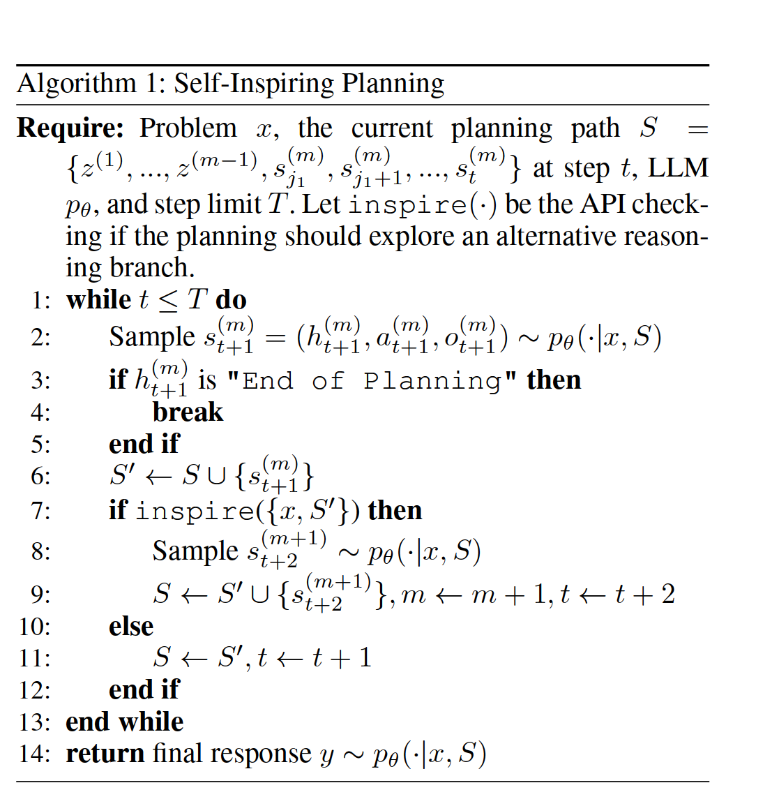

# RecMind: Large Language Model Powered Agent For Recommendation    
## implementation using Tree of Thoughts algorithm

### RecMind consists of:

- Planning which enables the agent to break complex recommendation tasks into manageable steps for efficient handling of complex situations. Each step of planning involves thought, action and observation

- Memory consisting of Personalized Memory and World Knowledge, each accessible through specific tools.

- Tools enhance the agent functionality on top of the LLM, such as retrieving relevant knowledge, or assisting with reasoning process. 

### Self-Inspiring.

### Self-Inspiring algorithm should break down a task to smaller sub-tasks for step-by-step planning.

### At each intermediate planning step, the agent “self-inspires” to consider all previously explored planning paths to explore the next planning states. Unlike existing Chain-of-Thoughts and Tree-of-Thoughts which discards states (thoughts) in previously explored paths when generating a new state, SI retains all previous states from all history paths when generating new state.

### The Self_inspiring_DFS.py file includes the implementation of the Self-Inspiring algorithm based on the DFS algorithm made in the article Tree of Thoughts.

### Brief description of the code:

### the script includes functions for sampling from a distribution, incorporating a self-inspiring algorithm, building a tree of thoughts, and sampling the final response. The main algorithm is a while loop that samples the next step, checks for the end of planning, and either continues the current path or explores an alternative reasoning branch based on the "inspire" function.
### The "inspire" function initializes a tree, builds the tree of thoughts using depth-first search (DFS), and chooses the sequence with the highest score as the final sequence, as well the "inspire" function incorporates a self-inspiring algorithm that checks the cache for previously computed responses and expands the current node by adding child nodes for each candidate sequence in S. This suggests that the algorithm takes into account previous paths and uses them to inform the decision-making process for generating the next step of planning.

### The "sample_from_distribution" function samples responses and incorporates the self-inspiring algorithm by checking the cache for previously computed responses. 

### The code also includes a "compute_score" function for calculating the score of a sequence based on a provided scoring matrix and gap penalty.

links to RecMind article <https://arxiv.org/pdf/2308.14296v1.pdf>

link to Tree of Thoughts article <https://arxiv.org/pdf/2305.10601v2.pdf>